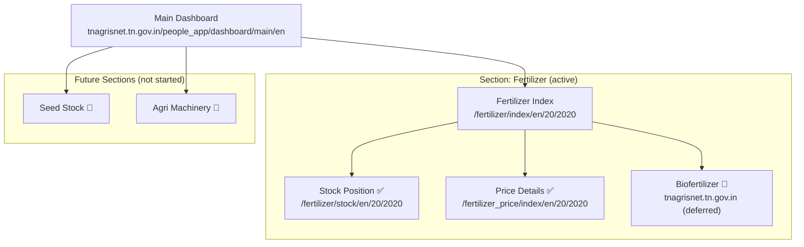
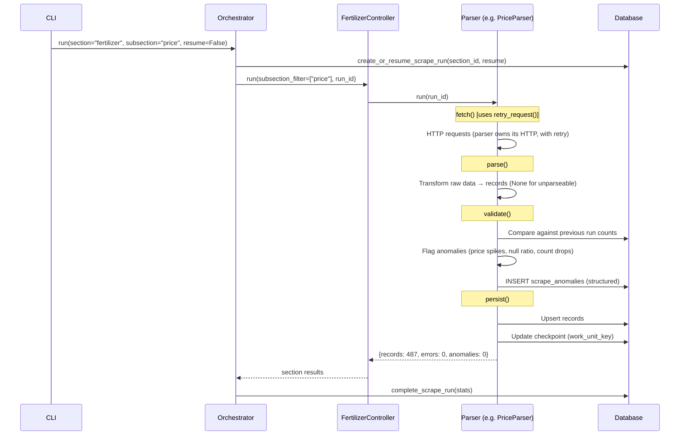
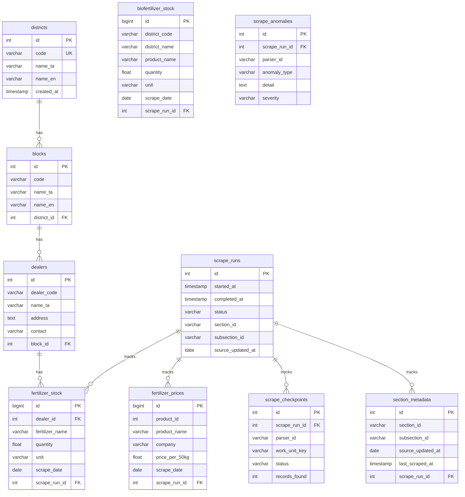

# 🌾 TFAIS — Modular Scraper Architecture (HLD v2.2)

**Tamil Nadu Fertilizer & Agricultural Intelligence System**

> v2.2 — Final revision. Fixes: `safe_parse_number` None semantics, configurable validation thresholds, `retry_request()` wired to Price parser, `scrape_anomalies` table replaces TEXT column, `--resume` flag for checkpoint continuity, concurrency constraint documented.
> Supersedes `revised_HLD.md`, HLD v2.0, and v2.1.

---

## 1. Problem Evolution

### Phase 1 (completed)
Single-purpose scraper: district→block→dealer fertilizer stock data via POST-based form. Working, but tightly coupled to one page.

### Phase 2 (this document)
The source platform has **multiple independent sections** with different page structures and data formats. We need a modular system — but we only have **one section (Fertilizer)** with two working parsers today. The architecture must avoid over-engineering for scale we haven't reached yet.

**Guiding principle:** *Let abstraction emerge from real duplication, not anticipated duplication.*

---

## 2. Source Platform Map



| Subsection | Server | Auth | Data Shape | Parser Owns HTTP Via |
|---|---|---|---|---|
| Fertilizer Stock | `115.243.209.84` | Session cookie | Dealer-level, per-block | `requests.Session()` internally |
| Fertilizer Price | `115.243.209.84` | None (stateless) | Product-level, global | `requests.post()` directly |
| Biofertilizer | `tnagrisnet.tn.gov.in` | None | District-level | TBD (REST or Playwright) |

---

## 3. System Architecture

### 3.1 Design Decisions (post-review)

| Decision | Rationale |
|---|---|
| **No `SectionRegistry`** | We have n=1 section. Auto-discovery is a framework concern we don't need yet. |
| **No `BaseSection` / `BaseParser` ABCs** | Extract common interface when the second section proves what's actually shared. |
| **No `HttpClient` wrapper** | Each parser has different HTTP needs (session vs stateless vs future Playwright). 10 lines of `requests.Session()` doesn't need a class. |
| **No `DataNormalizer` service** | Tamil→English map is only used by StockPosition. Keep it inside that parser. |
| **Delete legacy `scraper/` and `parser/`** | Two code paths for the same domain = two places for bugs. Migrate and delete. |
| **Validation is a first-class step** | `fetch → parse → validate → persist`. Government data is unreliable. |
| **`safe_parse_number` returns `None`** | "No data" ≠ "zero stock." Callers decide: `or 0.0` for stock, keep `None` for price. Prevents silent 0.0 masking data loss. |
| **Anomalies in structured table** | `scrape_anomalies` table (run_id, parser_id, type, detail) instead of TEXT column. Queryable for `--check-health`. |
| **Validation thresholds are constants** | `COUNT_DROP_THRESHOLD`, `PRICE_SPIKE_MULTIPLIER`, `MAX_NULL_RATIO` — per parser, not magic numbers. |
| **Monitoring via `--check-health`** | "Data stopped silently" is the most dangerous failure mode for pipelines. |
| **`--resume` for crashed runs** | Reuses last incomplete `run_id` so checkpoints aren't orphaned on restart. |
| **Generic checkpoints** | Each parser defines its own work unit key — not hardcoded to `(district, block)`. |

### 3.2 Layer Diagram

```
┌─────────────────────────────────────────────────────────────────────────┐
│  LAYER 1: ENTRY                                                        │
│  ┌──────────┐  ┌──────────┐  ┌──────────┐                             │
│  │ CLI      │  │ Scheduler│  │ FastAPI  │                             │
│  │ main.py  │  │ (cron)   │  │ api/     │                             │
│  └─────┬────┘  └─────┬────┘  └─────┬────┘                             │
│        └──────────────┼──────────────┘                                  │
│                       ▼                                                 │
├─────────────────────────────────────────────────────────────────────────┤
│  LAYER 2: ORCHESTRATION                                                │
│  ┌────────────────────────────────────┐                                │
│  │ Orchestrator                       │                                │
│  │  - Creates ScrapeRun               │                                │
│  │  - Calls section controllers       │                                │
│  │  - Runs health checks             │                                │
│  └─────────────┬──────────────────────┘                                │
│                ▼                                                        │
├─────────────────────────────────────────────────────────────────────────┤
│  LAYER 3: SECTION CONTROLLERS                                          │
│                                                                         │
│  ┌─ FertilizerController ────────────────────────────────────┐         │
│  │  (plain class, no ABC inheritance)                         │         │
│  │                                                            │         │
│  │  ┌─────────────────┐  ┌─────────────────┐  ┌───────────┐ │         │
│  │  │ StockPosition   │  │ FertilizerPrice │  │ Biofert.  │ │         │
│  │  │ Parser          │  │ Parser          │  │ (stub)    │ │         │
│  │  │                 │  │                 │  │           │ │         │
│  │  │ owns Session()  │  │ stateless POST  │  │ 🔮 future │ │         │
│  │  │ owns Tamil→En   │  │ no session      │  │           │ │         │
│  │  │ owns checkpts   │  │ owns checkpts   │  │           │ │         │
│  │  └─────────────────┘  └─────────────────┘  └───────────┘ │         │
│  └───────────────────────────────────────────────────────────┘         │
│                                                                         │
├─────────────────────────────────────────────────────────────────────────┤
│  LAYER 4: SHARED UTILITIES (thin — only what's truly shared)           │
│  ┌────────────────────────┐  ┌──────────────────────────────┐         │
│  │ core/http_utils.py     │  │ core/metadata.py             │         │
│  │  • retry_request()     │  │  • extract_last_updated()    │         │
│  │  • rate_limit()        │  │  • DD-MM-YYYY parsing        │         │
│  │  • DEFAULT_HEADERS     │  │                              │         │
│  └────────────────────────┘  └──────────────────────────────┘         │
│                                                                         │
├─────────────────────────────────────────────────────────────────────────┤
│  LAYER 5: DATABASE                                                      │
│  ┌──────────────┐  ┌──────────────┐  ┌──────────────────────┐         │
│  │ Alembic      │  │ ORM Models   │  │ Operations           │         │
│  │ migrations/  │  │ models.py    │  │ upsert, bulk insert  │         │
│  └──────────────┘  └──────────────┘  └──────────────────────┘         │
│                                                                         │
│  Tables: districts, blocks, dealers, fertilizer_stock,                  │
│  fertilizer_prices, biofertilizer_stock, scrape_runs,                   │
│  scrape_checkpoints, section_metadata                                   │
└─────────────────────────────────────────────────────────────────────────┘
```

### 3.3 Data Pipeline Flow



---

## 4. HTTP Ownership

**No shared HttpClient class.** Each parser manages HTTP directly.

| Parser | HTTP Approach | Why |
|---|---|---|
| StockPosition | `requests.Session()` — internal to parser | Needs cookies, CSRF token, hidden form fields |
| FertilizerPrice | `requests.post()` — plain function call | Stateless. No session. No CSRF. |
| Biofertilizer (future) | TBD — `requests` or Playwright | Different domain, Angular SPA |

**Shared utilities** (in `core/http_utils.py`):

```python
# This is ~20 lines total. Not a class.

DEFAULT_HEADERS = {
    "User-Agent": "Mozilla/5.0 (Windows NT 10.0; Win64; x64) ...",
    "Accept-Language": "en-US,en;q=0.9,ta;q=0.8",
}

def retry_request(fn, max_retries=3, backoff=2):
    """Generic retry with exponential backoff. Works with any callable."""
    for attempt in range(max_retries):
        try:
            return fn()
        except Exception as exc:
            if attempt == max_retries - 1:
                raise
            time.sleep(backoff ** attempt)

def rate_limit(seconds=2):
    """time.sleep(seconds). That's it."""
    time.sleep(seconds)
```

**Rule:** Every HTTP call — session-based or stateless — must go through `retry_request()`. No bare `requests.post()` without retry.

---

## 5. Validation Strategy

### 5.1 Why This Matters

Government data sources are unreliable. The most dangerous failure is **silent data loss** — the scraper runs, returns zero records, and nobody notices for weeks.

### 5.2 `safe_parse_number` Returns `None`, Not 0.0

The previous design silently converted garbage values (`"*"`, `"N/A"`, `"--"`) to `0.0`. This conflates "no data" with "zero stock." A dealer with 0 kg Urea is meaningfully different from a dealer whose value was `"*"` (unknown).

```python
def safe_parse_number(text: str) -> float | None:
    """Returns None for unparseable. Caller decides what None means."""
    if not text or not text.strip():
        return None
    text = text.strip()
    if text in ("-", "--", "N/A", "nil", "Nil", "NIL", "*"):
        return None   # explicitly unknown, NOT zero
    text = text.replace(",", "").replace(" ", "")
    try:
        return float(text)
    except ValueError:
        return None
```

**Caller semantics:**
- **Stock Position**: `qty = safe_parse_number(v) or 0.0` — zero is valid for stock
- **Price**: `price = safe_parse_number(v)` — persist `None` as `NULL`, validation catches too many NULLs

### 5.3 Three-Level Validation

```
fetch → parse → VALIDATE → persist
                    │
                    ├── Page-level: Is this really empty, or did the page break?
                    ├── Record-level: Are values within expected ranges? Too many NULLs?
                    └── Run-level: Does this run's total make sense vs history?
```

| Level | Check | Example | Action |
|---|---|---|---|
| **Page** | Zero results but previous run had data | District had 50 dealers, now 0 | Flag ERROR, not EMPTY |
| **Record** | Value outside expected range | Price = -50 or Price > SPIKE_MULTIPLIER × median | Persist + write `scrape_anomalies` row |
| **Record** | Too many NULL values | >MAX_NULL_RATIO of records returned None from parse | Flag data quality issue |
| **Run** | Total count anomaly | This run < COUNT_DROP_THRESHOLD × previous | Mark run `suspicious` |

### 5.4 Validation Thresholds: Parser-Level Constants

No magic numbers buried in methods. Each parser declares its own thresholds:

```python
class StockPositionParser:
    COUNT_DROP_THRESHOLD = 0.5     # 50% drop (15k records — catastrophic)
    MAX_NULL_RATIO = 0.1           # >10% NULLs = problem

class FertilizerPriceParser:
    COUNT_DROP_THRESHOLD = 0.3     # 30% drop (500 records — more volatile)
    PRICE_SPIKE_MULTIPLIER = 10    # >10x median = anomaly
    MAX_NULL_RATIO = 0.2           # >20% NULL prices = problem
```

### 5.5 Anomaly Storage: `scrape_anomalies` Table

Previous design used `anomaly_notes TEXT` on `scrape_runs`. Querying "which parsers flagged anomalies in the last 30 days" required `LIKE '%dropped%'`. Now structured:

```sql
CREATE TABLE scrape_anomalies (
    id             SERIAL PRIMARY KEY,
    scrape_run_id  INTEGER REFERENCES scrape_runs(id) NOT NULL,
    parser_id      VARCHAR(50) NOT NULL,
    anomaly_type   VARCHAR(50) NOT NULL,  -- 'count_drop', 'price_spike', 'null_ratio', 'new_products'
    detail         TEXT NOT NULL,
    severity       VARCHAR(20) DEFAULT 'warning',  -- 'warning', 'critical'
    created_at     TIMESTAMPTZ DEFAULT NOW()
);
```

`--check-health` can now query:
```sql
SELECT parser_id, anomaly_type, COUNT(*)
FROM scrape_anomalies WHERE created_at > NOW() - INTERVAL '30 days'
GROUP BY parser_id, anomaly_type;
```

### 5.6 Implementation

Each parser implements a `validate()` method:

```python
def validate(self, records: list, session) -> list[dict]:
    """
    Validate parsed records before persistence.
    Returns list of anomaly dicts for scrape_anomalies table.
    """
    anomalies = []
    
    # Run-level: compare against previous
    prev_count = get_previous_run_count(session, self.parser_id)
    if prev_count > 0 and len(records) < prev_count * self.COUNT_DROP_THRESHOLD:
        anomalies.append({
            "parser_id": self.parser_id,
            "anomaly_type": "count_drop",
            "detail": f"{prev_count} → {len(records)}",
            "severity": "critical",
        })
    
    # Record-level: NULL ratio
    # (parser-specific checks follow)
    ...
    
    return anomalies
```

---

## 6. Monitoring: `--check-health`

```bash
$ python main.py --check-health

TFAIS Health Report — 2026-03-30 18:00 IST
━━━━━━━━━━━━━━━━━━━━━━━━━━━━━━━━━━━━━━━━━

fertilizer.stock_position
  Last run:     2h ago (run #42, completed)
  Records:      14,832 (vs 7-day avg: 14,500 ✅)
  Source date:  29-03-2026
  
fertilizer.price
  Last run:     2h ago (run #43, completed)
  Records:      487 (vs 7-day avg: 490 ✅)
  
fertilizer.biofertilizer
  ⚠ NOT IMPLEMENTED (stub)

Anomalies: None
```

**Implementation:** A simple function that queries `scrape_runs`, `section_metadata`, and record count tables. No external monitoring infrastructure — just a CLI command that can be run by cron and piped to a log.

---

## 7. Checkpoint System (Generic)

### 7.1 Problem with v2.0

v2.0 checkpoints were `(district_code, block_code)` — hardcoded to the Stock Position iteration pattern. Price iterates products. Biofertilizer will iterate districts differently.

### 7.2 v2.2: Parser-owned, generic key + `--resume`

Each parser defines its own "unit of work" and manages checkpoints internally.

```sql
scrape_checkpoints (
    id             SERIAL PRIMARY KEY,
    scrape_run_id  INTEGER REFERENCES scrape_runs(id),
    parser_id      VARCHAR(50) NOT NULL,
    work_unit_key  VARCHAR(100) NOT NULL,
    status         VARCHAR(20) DEFAULT 'pending',
    records_found  INTEGER DEFAULT 0,
    error_message  TEXT,
    completed_at   TIMESTAMPTZ,
    UNIQUE(scrape_run_id, parser_id, work_unit_key)
);
```

| Parser | work_unit_key format | Example |
|---|---|---|
| StockPosition | `{district_code}:{block_code}` | `"3317:101"` |
| FertilizerPrice | `product:{product_id}` | `"product:1"` |
| Biofertilizer (future) | `district:{code}` | `"district:3317"` |

### 7.3 Resume: `--resume` Flag

**Problem:** If a run crashes and you restart with `python main.py --section fertilizer`, the orchestrator creates a new `run_id`. All previous checkpoints are orphaned — the parser restarts from scratch.

**Solution:** `--resume` reuses the last incomplete run_id:

```python
# In orchestrator:
if args.resume:
    run = find_last_incomplete_run(session, section_id)
    if not run:
        log.info("No incomplete run found, starting fresh")
        run = create_scrape_run(session, section_id)
else:
    run = create_scrape_run(session, section_id)

def find_last_incomplete_run(session, section_id) -> ScrapeRun | None:
    return session.scalar(
        select(ScrapeRun)
        .where(ScrapeRun.section_id == section_id,
               ScrapeRun.status.in_(["running", "failed", "partial"]))
        .order_by(ScrapeRun.started_at.desc())
        .limit(1)
    )
```

```bash
# Normal run (new run_id)
python main.py --section fertilizer

# Resume crashed run (reuses last incomplete run_id)
python main.py --section fertilizer --resume
```

---

## 8. Database Schema

### 8.1 Entity-Relationship Diagram



### 8.2 Schema Changes from v2.0/v2.1

| Change | What |
|---|---|
| `scrape_runs` | Dropped `anomaly_notes TEXT` — replaced by `scrape_anomalies` table |
| `scrape_anomalies` | **New table** — structured anomaly storage (run_id, parser_id, type, detail, severity) |
| `scrape_checkpoints` | Replaced `district_code`/`block_code` with `parser_id` + `work_unit_key` |
| `biofertilizer_stock` | FK to `scrape_runs(id)` now consistent across all docs |

### 8.3 Alembic Migration Sequence

1. `001_add_bilingual_columns` — Add `name_en` to districts and blocks
2. `002_add_scrape_run_fields` — Add `section_id`, `subsection_id`, `source_updated_at`
3. `003_create_fertilizer_prices` — New table
4. `004_create_biofertilizer_stock` — New table (empty for now)
5. `005_create_section_metadata` — New table
6. `006_refactor_checkpoints` — Add `parser_id`, `work_unit_key`; drop old columns
7. `007_create_scrape_anomalies` — New structured anomalies table

---

## 9. Extensibility: When to Abstract

**Current state:** One section, two parsers. No abstractions beyond plain classes.

**When to create shared interfaces:**
- When we add the **second section** (Seed Stock or Machinery)
- And we observe **actual code duplication** between controllers or parsers
- Then extract the common pattern into a base class or protocol

**Not before.** The risk of premature abstraction is refactoring interfaces that were designed without real usage data.

### Concurrency Constraint

**Current design: sequential only.** Both parsers iterate with `time.sleep()` between requests. Stock Position does ~570 (district×block) combinations at 2s each — that's ~19 min for a full run.

If parallelism is needed later, the current "parser owns everything including sleep timing" design must be refactored:
- Replace `time.sleep()` with async-compatible rate limiting
- Move to `asyncio` + `aiohttp` or a thread pool with a shared rate limiter
- Checkpoint writes must become thread-safe

**This is a known trade-off:** simplicity now, harder to parallelize later. Acceptable at current scale.

---

## 10. Error Handling

```
Orchestrator
  │
  ├─ Controller fails? → log, report error, continue
  │
  └─ FertilizerController
       │
       ├─ Parser fails? → log, skip, continue to next parser
       │
       └─ StockPositionParser
            ├─ District fails? → log, skip, continue
            ├─ Block fails? → checkpoint error, continue
            └─ Card fails? → save snapshot, continue
```

Every level: `try/except → log → continue`. Nothing kills the pipeline.
